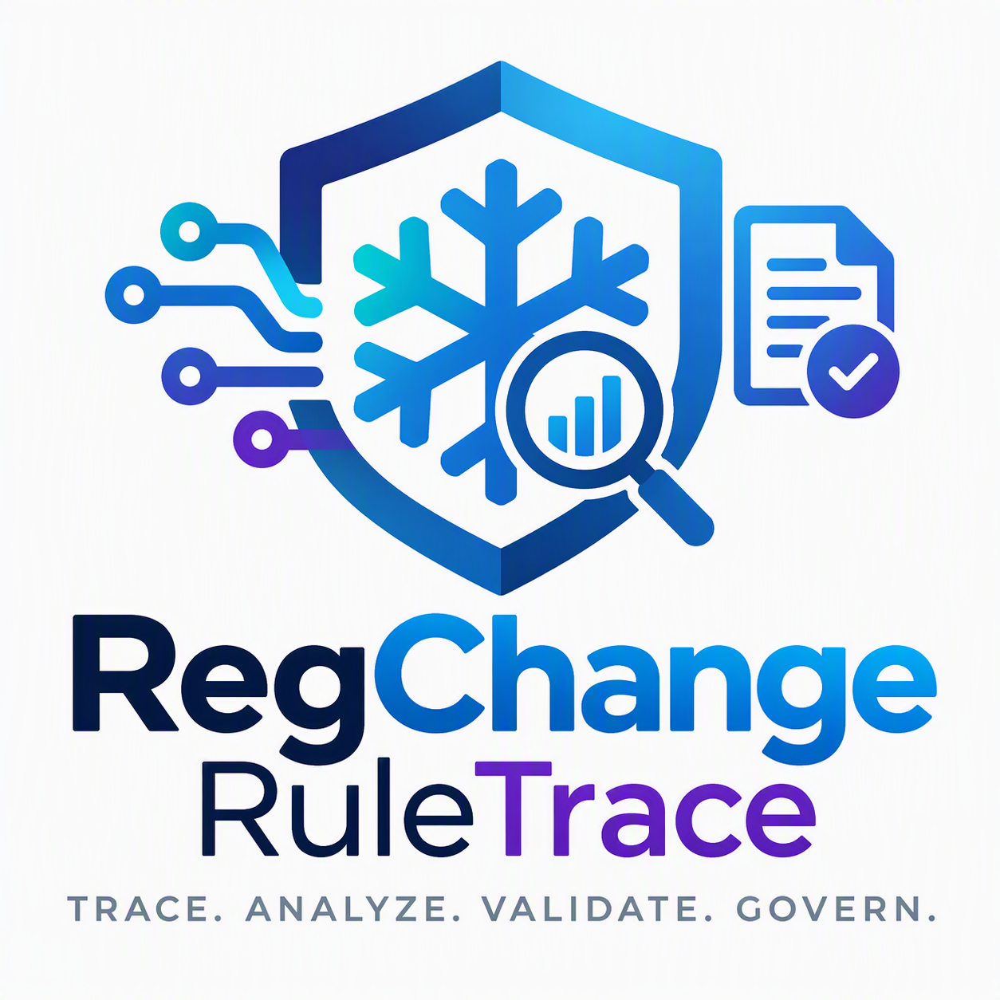

# RegChange RuleTrace



**Regulatory Change Impact & Control Intelligence**

Trace. Analyze. Validate. Govern.

> Snowflake CoCo CLI Hackathon 2026 — Problem Statement 01: Risk, Fraud and Regulatory Intelligence Copilot

[Live prototype](https://app.snowflake.com/QGSNKWX/md84147/#/streamlit-apps/REGCHANGE_DB.REGCHANGE.REGCHANGE_APP) · [Submission PDF](docs/RegChangeRuleTrace_Submission.pdf) · [Presentation](docs/RegChangeRuleTrace_Submission.pptx)

The prototype requires Snowflake sign-in and appropriate app access. The app link is not an anonymous public demo; confirm the organizer's judge-access arrangement. All policy text and transactions are fictional/synthetic, not production AML advice.

## What It Does

RegChange demonstrates a focused regulatory-change impact assessment for banking/NBFC compliance teams. The illustrative scenario lowers a high-value transaction-monitoring threshold, without claiming to implement an actual regulatory circular:

1. **Extracts proposed fields** from fictional policy text using Cortex COMPLETE, for human verification.
2. **Uses a predefined control** — the versioned `AML_THRESHOLD_10L` baseline, not general automatic control discovery.
3. **Replays history** — typed SQL evaluates both thresholds on a zero-copy clone of the transaction table.
4. **Quantifies impact** — alert counts, delta, percentage change, total alerted accounts and accounts with transactions in the newly monitored amount band.
5. **Records human review** — a reviewer approves or rejects a saved run with a comment. Approval does not apply the preview SQL or promote a rule.
6. **Supports business questions** through Cortex Analyst and a Semantic View. Generated answers and summaries require review.

The demo result: *"This proposed change adds 68 transaction alerts; 47 accounts have transactions in the newly monitored band. Here are the saved impact assessment and review record."* Those 47 are not necessarily first-time alerted accounts.

## Architecture


| App tab | Processing and output |
|---|---|
| Policy Extraction | Cortex COMPLETE proposes rule fields from text; selected values enter session state. |
| Run Backtest | SQL compares thresholds on a clone, persists metrics, then generates a summary and displays preview SQL. |
| Run History | Reads saved `BACKTEST_RUNS`. |
| Review & Approve | Writes reviewer, run ID, decision, comment and time to `REVIEW_LOG`. |
| Ask Analyst | Cortex Analyst uses `REGCHANGE_SEMANTIC`; the app displays and executes returned SQL. |

Tables and the procedure live in `REGCHANGE_DB.REGCHANGE`. The deployment manifest specifies the container runtime, `SYSTEM_COMPUTE_POOL_CPU`, and query warehouse `COMPUTE_WH`. SQL results are deterministic for fixed data and parameters; AI output can vary.

## Demo Scenario

A fictional regulator lowers the AML high-value transaction threshold from **₹10,00,000** (₹10 lakh) to **₹5,00,000** (₹5 lakh).

| Metric | Value | What It Means |
|---|---|---|
| Baseline alerts | 132 | Alerts under the current ₹10L rule |
| Proposed alerts | 200 | Alerts under the proposed ₹5L rule |
| Alert delta | +68 (+51.5%) | Additional operational workload |
| Accounts alerted | 50 | Total accounts flagged under the new rule |
| Accounts with New Alerts | 47 | Accounts with transactions above the proposed threshold and at or below baseline; some already have baseline alerts |

The legacy field `NEWLY_ALERTED_ACCOUNTS` stores this amount-band measure, not an account-set difference. In the unchanged fixture, the same 50 accounts have alerts under both thresholds: there are zero first-time alerted accounts. Results change if data, the selected active baseline or replay period changes.

## Prototype

**Live app:** [Streamlit in Snowflake](https://app.snowflake.com/QGSNKWX/md84147/#/streamlit-apps/REGCHANGE_DB.REGCHANGE.REGCHANGE_APP)

## Project Structure

```
regchange-ruletrace/
├── README.md
├── docs/
│   ├── RegChangeRuleTrace_Submission.pdf   # Portal deck
│   ├── RegChangeRuleTrace_Submission.pptx  # Editable presentation
│   ├── architecture-diagram.drawio        # Architecture source
│   └── challenges-and-decisions.md        # Implementation decisions
├── sql/
│   └── phase1/
│       ├── 01_initialize_regchange.sql   # Schema, tables, seed data, procedure
│       ├── 02_create_semantic_view.sql   # Cortex Analyst model
│       └── DDL_DML_REFERENCE.md          # Quick DDL/DML reference
├── streamlit/
│   ├── streamlit_app.py           # Streamlit app source
│   └── snowflake.yml              # Deployment manifest
└── .github/
    └── prompts/
        └── resume-regchange.prompt.md    # CoCo CLI resume prompt
```

## Setup and Run

### Prerequisites
- A Snowflake role allowed to create the database/schema, tables, procedure and Semantic View, plus access to Cortex and app deployment resources. Use least privilege; `ACCOUNTADMIN` is not required for normal app use.
- A warehouse (XS is sufficient)
- Snowflake CLI compatible with the container-runtime deployment manifest (or deploy via Snowsight)

Execute setup in the order below. Create `REVIEW_LOG` before the Semantic View and before opening the app. No credentials should be committed to the repository.

### Phase 1: Data Foundation
```sql
-- Connect to your target database, then:
CREATE DATABASE IF NOT EXISTS REGCHANGE_DB;
USE DATABASE REGCHANGE_DB;

-- Run the full Phase 1 script:
-- sql/phase1/01_initialize_regchange.sql

-- Verify with the sample backtest:
CALL REGCHANGE_DB.REGCHANGE.RUN_THRESHOLD_BACKTEST(
    500000.00,
    '2026-07-01 00:00:00'::TIMESTAMP_NTZ,
    '2026-10-01 00:00:00'::TIMESTAMP_NTZ
);
-- Expected: 132 baseline, 200 proposed, +68 delta, 50 alerted accounts,
-- 47 accounts with transactions in the newly monitored amount band.
```

### Phase 2: Review Table
```sql
CREATE TABLE IF NOT EXISTS REGCHANGE_DB.REGCHANGE.REVIEW_LOG (
    REVIEW_ID    VARCHAR(36)    NOT NULL,
    RUN_ID       VARCHAR(36)    NOT NULL,
    REVIEWER     VARCHAR(128)   NOT NULL,
    DECISION     VARCHAR(16)    NOT NULL,
    COMMENT      VARCHAR(500),
    REVIEWED_AT  TIMESTAMP_NTZ  DEFAULT CURRENT_TIMESTAMP()
);
```

### Phase 3: Semantic View

Run [02_create_semantic_view.sql](sql/phase1/02_create_semantic_view.sql) after all four tables exist. The definition declares 10 metrics, 13 dimensions and 5 facts, with a review-to-backtest relationship. Grant the execution/app role the necessary object and AI-service access according to the target account's policies.

### Phase 4: Deploy Streamlit App

```bash
cd streamlit/
snow streamlit deploy --replace
```

The app deploys to `REGCHANGE_DB.REGCHANGE.REGCHANGE_APP` on the container runtime. Deployment and AI availability depend on account permissions and supported features.

## How to Test

1. Open the app with an authorized Snowflake session; confirm the original baseline and seeded data.
2. **Policy Extraction** — extract the fictional sample and verify the proposed threshold, currency and dates. Check actual sidebar values; do not assume the success message proves widget updates.
3. **Run Backtest** — use proposal 500000 and July 1 inclusive to October 1 exclusive; check the metrics above and retain the run ID.
4. **Run History** — find that exact ID. A repeat with unchanged inputs/data should give the same metrics but a new ID.
5. **Review & Approve** — submit a comment and verify the linked review record. The baseline must remain unchanged; do not execute remediation SQL.
6. **Ask Analyst** — ask how many transactions there are; inspect SQL/result. The original fixture has 10000. The high-value metric uses a fixed INR 1000000 threshold, not the sidebar value.

Run sequentially, not concurrently. Invalid replay dates should return an error; a blank review comment should be rejected by the UI. Live deployment, AI responses and judge access must be verified separately from source inspection.

## Technology Stack

| Component | Technology |
|---|---|
| Data platform | Snowflake |
| Schema & procedures | Snowflake SQL |
| Policy extraction and summaries | Cortex COMPLETE |
| Business questions | Cortex Analyst REST API + Semantic View |
| Replay snapshot | Transient zero-copy clone |
| App runtime | Streamlit in Snowflake (container runtime) |
| Compute | SYSTEM_COMPUTE_POOL_CPU + COMPUTE_WH (XS) |
| Development | Snowflake Cortex Code CLI (CoCo) |
| Deployment | Snowflake CLI (`snow streamlit deploy`) |

## Datasets

All transaction data is **synthetic**, generated deterministically within the Phase 1 SQL script. The sample policy is authored fictional demonstration text, not a real regulatory notice. No external datasets or third-party data feeds are used; the app does call Snowflake's Cortex Analyst REST API.

- 10,000 INR transactions across 2,500 accounts over a 90-day window (Jul-Sep 2026)
- 1 baseline regulatory control rule (`AML_THRESHOLD_10L` at ₹10,00,000)
- Transaction types: UPI, CARD, BANK_TRANSFER, CASH

## Scoring Rubric Alignment

| Criterion | Weight | How Addressed |
|---|---|---|
| Real-World Relevance | 30% | AML threshold changes are a real banking/NBFC compliance workflow |
| Technical Execution | 40% | Snowflake-native: SQL procedures, container-runtime Streamlit, versioned metadata, CoCo CLI development |
| Solution Completeness | 30% | End-to-end: policy proposal → control mapping → backtest → quantified impact → human approval with audit trail |

## Limitations and Future Work

- **Current scope:** Single threshold-change scenario with synthetic data
- **Not included:** Real regulatory document parsing (PDF ingestion), multi-regulator support, enterprise-wide lineage discovery, automatic rule promotion
- **Audit boundary:** Backtest runs and reviews are persisted; original policy/extraction evidence is not yet stored and linked end-to-end.
- **Snapshot boundary:** The shared clone name is not concurrency-safe and the clone is dropped after calculation. Retained snapshot references and failure cleanup need hardening.
- **AI boundary:** Human verification is expected, but extraction does not enforce a complete confirmation/validation gate. Generated SQL and summaries require checking. The summary prompt defines the band-account metric explicitly and prohibits unsupported first-time-account and staffing claims; this does not guarantee every model response follows those instructions.
- **Promotion boundary:** Remediation SQL is preview-only; effective dates and atomic versioning need validation before any production execution.
- **Freshness:** Transactions are seeded, not continuously ingested. Source CDC/file ingestion and derived-table refresh are production enhancements, not implemented capabilities.
- **Future:** Dynamic Tables for continuous impact monitoring, DMFs for data quality checks (not available on trial account), Cortex Search for policy document library, multi-regulator circular support (RBI, SEBI, IRDAI)

## Submission Description

RegChange RuleTrace is a solo-built Snowflake-native prototype for evaluating fictional AML threshold changes. Cortex COMPLETE proposes structured policy fields for human verification. Typed SQL compares the predefined versioned baseline with a proposed threshold on a zero-copy clone of synthetic transactions. The sample produces 132 baseline and 200 proposed alerts (+51.5%); 47 accounts have transactions in the newly monitored amount band, not necessarily first-time alerts. Streamlit shows metrics, run history, an AI-generated summary and preview-only remediation SQL. Human review is recorded against a run without automatically promoting a rule. Cortex Analyst supports business questions through a Semantic View. Built with Snowflake CoCo CLI. All policy text and transactions are synthetic, not production AML advice.
